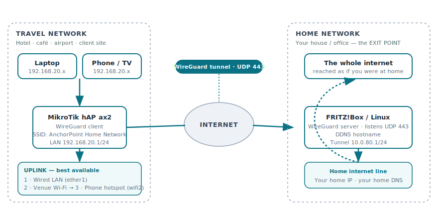

# AnchorPoint VPN

**Carry your home network with you.** AnchorPoint is an open-source blueprint for a
travel router that tunnels every device you plug into it back to your home
network over WireGuard — so wherever you are in the world, you browse, stream and
work as if you were sitting on your own couch. Your **home** is the exit point:
all traffic leaves the internet from your home connection, with your home IP,
your home DNS and your home geolocation.

The travel router is a **MikroTik hAP ax2**. It automatically chooses the best
available uplink — **wired LAN → public/venue Wi-Fi → phone hotspot** — and fails
over between them without you touching anything. The tunnel runs over **UDP port
443**, the same port as HTTPS, so it survives the restrictive hotel, café and
airport firewalls that block "real" VPN ports.

> AnchorPoint was previously known internally as *Hush Trips VPN*.

---

## What this gives you

- **One SSID, everywhere.** Join `AnchorPoint Home Network` on your laptop/phone
  and you are on your home LAN — same subnet reachability, same DNS, same exit IP.
- **Firewall-friendly.** The tunnel uses `UDP/443`. Captive portals and corporate
  firewalls that only allow web traffic still let the tunnel through.
- **Automatic uplink failover.** Cable if present, else venue Wi-Fi, else your
  phone's hotspot. Priority-based, self-healing, with a 15-minute probe that
  returns to the better uplink once it recovers.
- **Self-hosted.** The home end can be a plain **FRITZ!Box** (built-in WireGuard)
  or any Linux box running WireGuard. No cloud, no third-party VPN provider, no
  subscription.
- **Fully open.** Every command is in [`config/`](config/) and
  [`docs/`](docs/). Nothing is hidden in a binary.

---

## Two networks, one tunnel

AnchorPoint is deliberately split into **two independent networks**. Keep them
straight and everything else follows.

| | **Home network** | **Travel network** |
|---|---|---|
| Where | Your house / office | Hotel, café, airport, client site |
| Hardware | FRITZ!Box or Linux + WireGuard **server** | MikroTik hAP ax2 **client** |
| Role | **Exit point** — traffic reaches the internet here | Entry point — collects your devices |
| WireGuard | Listens on **UDP 443** | Dials out to home on **UDP 443** |
| LAN subnet | `10.0.80.0/24` (tunnel) | `192.168.20.0/24` (your devices) |
| Reachability | Static, always-on, DDNS name | Roams between uplinks |

---

## Documentation

Read the docs in order:

1. [**01 — Prerequisites**](docs/01-prerequisites.md) — what you need before you start.
2. [**02 — Home: WireGuard server (FRITZ!Box)**](docs/02-home-wireguard-server-fritzbox.md) — build the exit point, port-forward `UDP/443`, set up DDNS.
3. [**03 — Travel router: MikroTik hAP ax2**](docs/03-travel-router-mikrotik.md) — import the client config, broadcast the home SSID, route everything through the tunnel.
4. [**04 — Uplink failover (LAN → Wi-Fi → Hotspot)**](docs/04-uplink-failover.md) — how the priority switching works and how to type in your venue Wi-Fi and phone hotspot credentials.
5. [**05 — Ports & networks reference**](docs/05-ports-and-networks.md) — exact ports used on the home side and the travel side.

Ready-to-edit config files live in [`config/`](config/).

---

## Bill of materials

| Item | Notes |
|---|---|
| MikroTik hAP ax2 (`C52iG-5HaxD2HaxD`) | The travel router. Dual-band Wi-Fi 6, 5× Gigabit, USB. |
| FRITZ!Box 4xxx/5xxx/6xxx (FRITZ!OS ≥ 7.50) **or** any Linux host | The home WireGuard server. |
| A home internet connection with a routable IPv4 (or DS-Lite + workaround) | Needed to reach the tunnel from outside. |
| DDNS hostname | MyFRITZ! is free and automatic; any DDNS provider works. |

---

## Security note

All keys, passwords, SSIDs, hostnames and IPs in this repository are
**placeholders** (`<LIKE_THIS>`) or documentation-only examples. **Generate your
own WireGuard keys** and never commit real private keys, pre-shared keys or
Wi-Fi passwords. See [`.gitignore`](.gitignore).

---

## License

[MIT](LICENSE) © XpertOne Security Consulting GmbH. Use it, fork it, ship it.
