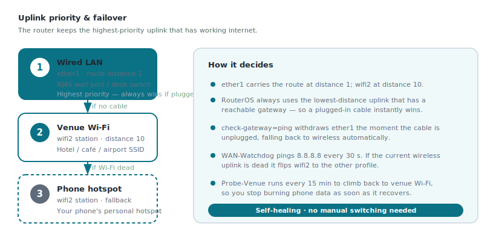

# 04 — Uplink failover (LAN → Wi-Fi → Hotspot)

The travel router needs *some* way onto the internet before it can build the
tunnel home. AnchorPoint supports **three uplinks** and picks the best one
automatically, in this priority order:

| Priority | Uplink | Interface | How it's chosen |
|---|---|---|---|
| **1 (highest)** | **Wired LAN** — hotel wall port, client desk, RJ45 | `ether1` | Lowest route distance; wins whenever a cable is plugged in and its gateway pings. |
| **2** | **Venue Wi-Fi** — hotel / café / airport | `wifi2` (station) | Used when no cable; router associates to `<VENUE_WIFI_SSID>`. |
| **3 (fallback)** | **Phone hotspot** | `wifi2` (station) | Used when the venue Wi-Fi drops; router switches to `<PHONE_HOTSPOT_SSID>`. |



**How the priority actually works:**

- **Wired always wins.** `ether1` gets the DHCP route at distance `1`; `wifi2`
  gets it at distance `10`. RouterOS always prefers the lower distance, and
  `check-gateway=ping` on `ether1` withdraws the wired route the instant the
  cable is unplugged — so plugging in a cable instantly takes over, unplugging it
  instantly falls back to wireless.
- **Wi-Fi vs. hotspot** share the single `wifi2` radio, so the router can only be
  associated to one at a time. A **netwatch watchdog** pings `8.8.8.8` every 30 s;
  if the current wireless uplink goes dead it flips `wifi2` to the *other*
  profile. A **15-minute probe** keeps trying to climb back to the preferred
  venue Wi-Fi so you don't burn phone data longer than necessary.

---

## Step 1 — Turn `wifi2` into an uplink (station) radio

By default `wifi2` is an access point. Take it out of the VPN bridge and make it
a WAN station instead:

```rsc
/interface/bridge/port/remove [find interface=wifi2]
/interface/list/member/add interface=wifi2 list=WAN
/interface/wifi/unset wifi2 configuration.mode
/interface/wifi/unset wifi2 configuration.ssid
/interface/wifi/unset wifi2 security.authentication-types
/interface/wifi/unset wifi2 security.passphrase
/interface/wifi/set wifi2 security.ft=no
/interface/wifi/set wifi2 security.ft-over-ds=no
```

---

## Step 2 — Type in the **venue Wi-Fi** SSID + password

This is the hotel / café / airport network you connect *to*. Replace both
placeholders with what the venue gave you:

```rsc
/interface wifi security add name=wifi-sec-venue \
    authentication-types=wpa2-psk,wpa3-psk passphrase="<VENUE_WIFI_PASSWORD>"
/interface wifi configuration add name=wifi-cfg-venue mode=station \
    ssid="<VENUE_WIFI_SSID>" security=wifi-sec-venue disabled=no datapath.bridge=none
```

> Captive-portal venues (a web login page) will still need you to open a browser
> once and accept their terms. After that, the tunnel comes up on top.

---

## Step 3 — Type in the **phone hotspot** SSID + password

This is your phone's personal hotspot, used when the venue Wi-Fi fails. On your
phone, set a **fixed hotspot name and password** and enter them here:

```rsc
/interface wifi security add name=wifi-sec-hotspot \
    authentication-types=wpa2-psk,wpa3-psk passphrase="<PHONE_HOTSPOT_PASSWORD>"
/interface wifi configuration add name=wifi-cfg-hotspot mode=station \
    ssid="<PHONE_HOTSPOT_SSID>" security=wifi-sec-hotspot disabled=no datapath.bridge=none
```

---

## Step 4 — Bring `wifi2` up on the venue profile and get an IP at distance 10

```rsc
/interface/wifi set wifi2 configuration=wifi-cfg-venue
/ip/dhcp-client/add interface=wifi2 disabled=no default-route-distance=10 comment="WiFi-WAN-Uplink"
```

---

## Step 5 — Make the wired port the top-priority uplink

`ether1` is the default WAN. Give it gateway monitoring so it hands over cleanly:

```rsc
/ip/dhcp-client/set [find interface=ether1] check-gateway=ping
```

`ether1` keeps its default distance (`1`), so **cable beats wireless** whenever a
cable is present.

---

## Step 6 — Failover scripts + watchdog + probe

Two scripts flip `wifi2` between the venue and hotspot profiles; netwatch drives
them; a scheduler probes back to the venue Wi-Fi every 15 minutes.

```rsc
# Switch wifi2 to the VENUE profile (and renew DHCP once associated)
/system/script/add name="Switch-To-Venue" source={
    :local i "wifi2"; :local h "wifi-cfg-venue"; :local c "";
    /interface/wifi/print where name=$i do={:set c $configuration};
    :if ($c != $h) do={
        :log warning "WAN: switching to Venue Wi-Fi...";
        /interface/wifi/unset $i configuration.mode;
        /interface/wifi/unset $i configuration.ssid;
        /interface/wifi/unset $i security.authentication-types;
        /interface/wifi/set $i configuration=$h;
        :local n 0;
        :while ([/interface/wifi/get $i running]=false && $n<20) do={:set n ($n+1); :delay 1s};
        :if ([/interface/wifi/get $i running]) do={
            /ip/dhcp-client/release [find interface=$i]; :delay 1s; /ip/dhcp-client/renew [find interface=$i];
        }
    }
}

# Switch wifi2 to the phone HOTSPOT profile
/system/script/add name="Switch-To-Hotspot" source={
    :local i "wifi2"; :local ip "wifi-cfg-hotspot"; :local c "";
    /interface/wifi/print where name=$i do={:set c $configuration};
    :if ($c != $ip) do={
        :log error "WAN: switching to phone hotspot...";
        /interface/wifi/unset $i configuration.mode;
        /interface/wifi/unset $i configuration.ssid;
        /interface/wifi/unset $i security.authentication-types;
        /interface/wifi/set $i configuration=$ip;
        :local n 0;
        :while ([/interface/wifi/get $i running]=false && $n<20) do={:set n ($n+1); :delay 1s};
        :if ([/interface/wifi/get $i running]) do={
            /ip/dhcp-client/release [find interface=$i]; :delay 1s; /ip/dhcp-client/renew [find interface=$i];
        }
    }
}

# Watchdog: if the current wireless uplink is dead, flip to the other one
/tool/netwatch/add host=8.8.8.8 interval=30s timeout=2s name="WAN-Watchdog" \
    up-script=":log info \"WAN: Internet is UP\"" \
    down-script=":delay 3s; :local i \"wifi2\"; :local vSSID [/interface/wifi/configuration/get [find name=\"wifi-cfg-venue\"] ssid]; :local cSSID [/interface/wifi/get \$i configuration.ssid]; :if (\$cSSID = \$vSSID) do={ /system/script/run Switch-To-Hotspot } else={ /system/script/run Switch-To-Venue }"

# Every 15 min, try to climb back to the preferred venue Wi-Fi
/system/scheduler/add name="Probe-Venue" interval=15m on-event="/system/script/run Switch-To-Venue"

/system/script/set [find name="Switch-To-Venue"]   owner=admin policy=read,write,policy,test dont-require-permissions=yes
/system/script/set [find name="Switch-To-Hotspot"] owner=admin policy=read,write,policy,test dont-require-permissions=yes
```

---

## Changing uplinks later, by hand

- **Force venue Wi-Fi now:** `/system/script/run Switch-To-Venue`
- **Force phone hotspot now:** `/system/script/run Switch-To-Hotspot`
- **Change the venue SSID/password** (new hotel each night):
  ```rsc
  /interface wifi configuration set wifi-cfg-venue ssid="<NEW_VENUE_SSID>"
  /interface wifi security      set wifi-sec-venue passphrase="<NEW_VENUE_PASSWORD>"
  /system/script/run Switch-To-Venue
  ```

The full failover block is in
[`config/mikrotik-uplink-failover.rsc`](../config/mikrotik-uplink-failover.rsc).

Next: [05 — Ports & networks reference](05-ports-and-networks.md)
